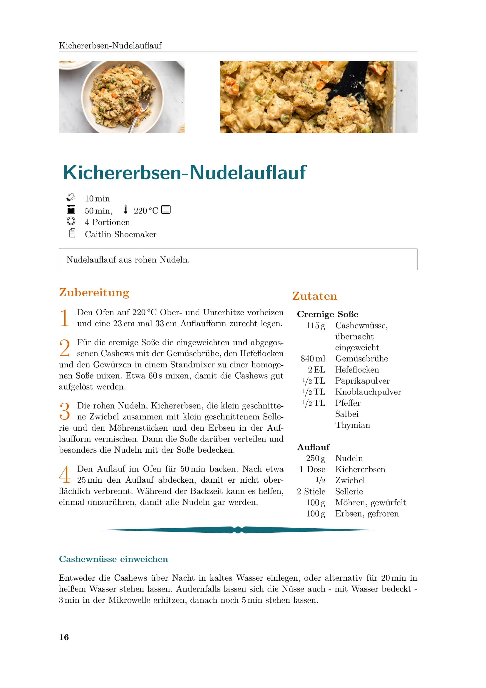
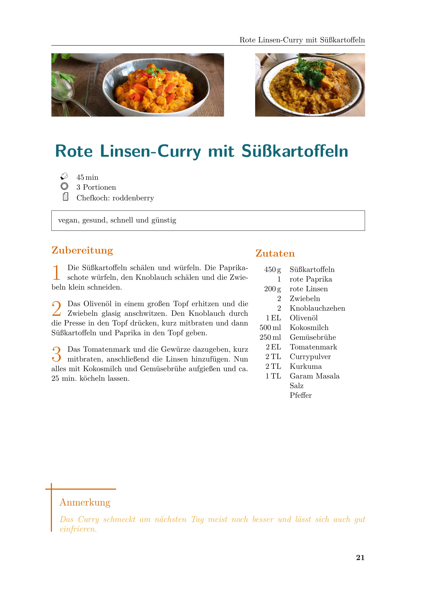
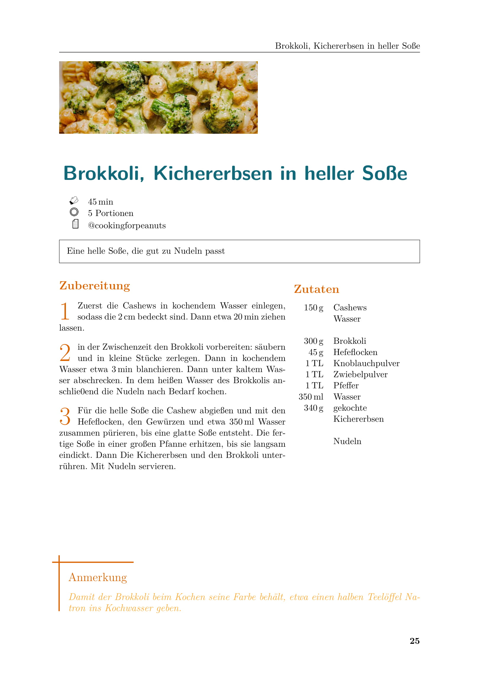

# Bronte-Project: KoXbuX
[DE] Rezeptesammlung - vegane Ideen in LaTeX gegossen

Mit Hilfe des ![f1]-Pakets [`xcookybooky`](https://www.ctan.org/pkg/xcookybooky).

## Inhalte dieser `README.md`
* [Beispiele: Auszüge der Rezepte](#Auszüge)
* [Beitrag leisten](#Beitragleisten)
  * [Synopse: `xcookybooky`-Paket](#Synopse)
  * [Rezept einpflegen](#einpflegen)
    * [Ordnerstruktur im Repository](#Ordnerstruktur)
    * [`recipe`-Umgebungen](#recipe-Umgebungen)
    * [`siunitx`-Paket](#siunitx)
    * [Abbildungen](#Abbildungen)
    * [Stichwortverzeichnis](#Stichwortverzeichnis)
    * [Rezept einbinden](#einbinden)
    * [Code-Beispiel](#Code-Beispiel)
  * [Fehler finden](#Fehler)


---
---
<a name="Auszüge"></a>
# Beispiele: Auszüge der Rezepte


---

---



---
---
<a name="Beitragleisten"></a>
# Beitrag leisten
Für jeden, der sich am Kochbuch beteiligen will - vor allem aber für mich selbst - ist die Zusammenfassung von allen wichtigen Befehlen und Funktionsweisen der LaTeX-Inhalte. Das `xcookybooky`-Paket liefert das Framework und ist selbst in weiten Teilen sehr modular nutzbar. Ich habe aber eine (übersichtliche?) Ordnerstruktur entworfen und eigene `recipe`-Umgebungen definiert, die die eigentliche `xcookybooky`-Umgebung erweitern. Abbildungen und Einträge im Stichwortverzeichnis lassen sich für jedes Rezept hinzufügen.


<a name="Synopse"></a>
## Synopse: [`xcookybooky`](https://www.ctan.org/pkg/xcookybooky)-Paket
1. **`recipe`-Umgebung**: Wird verwendet, um Rezepte einzufügen. Jedes Rezept wird in einer eigenen Umbegung eingebunden. Notwendig ist die Angabe des Namens des Rezeptes, optional lassen sich dazu noch die Vorbereitungszeit `preparationtime`, die Backzeit `bakingtime`, die Backtemperatur `bakingtemperature`, die Portionen `portion`, den Brennwert der Mahlzeit `calory`und die Quelle `source` angeben. **Achtung**: die originale `recipe`-Umgebung wird ersetzt durch selbst definierte Umgebungen mit den gleichen Optionen, nur anderen Namen (siehe [`recipe`-Umgebungen](#recipe-Umgebungen)). Dies ist zum einen notwendig, um die Platzierung der Bilder zu verbessern und gleichzeitig, um mit einem Zähler alle Rezepte zu indizieren.
2. **`\graph`**: Ermöglicht das Einbinden von bis zu zwei Abbildungen in einem Rezept: ein kleines (wird der Option `small` zugeordnet) und ein großes (wird der Option `big` zugeordnet). Damit der gesamte Platz ausgenutzt wird, die Bildseitenverhältnisse aus Abschnitt [Abbildungen](#Abbildungen) beachten.
3. **`\ingredients`**: Schafft die tabellarische Formatierung der benötigten Zutaten; dazu das LaTeX-typische `&`-Trennzeichen und den Zeilenumbruch `\\` verwenden. Zudem empfiehlt sich das [`siunitx`-Paket](#siunitx).
4. **`\preparation`**: Erzeugt den Textkörper der Durchführungsschritte mit Nummerierung in Form von Initialen.
5. **`\introduction`**: Ermöglicht das Hinzufügen eines Einführungstextes vor dem eigentlichen Rezept, aber nach den Kurzinformationen unter den Bildern.
6. **`\suggestion`**: Fügt nach den Zutaten und der Anleitung eine horizontale Abtrennung ein. Es lässt sich eine Überschrift definieren und ein Textkörper einfügen. In jedem Rezept können mehrere `\suggestion` eingefügt werden.
7. **`\hint`**: Fügt einen farblich hervorgehobenen Abschnitt unten auf einer Seite hinzu. Hier lassen sich Hinweise zum Rezept geben.
8. **`\portion`**: Hiermit können Portionen-Einträge einheitlich formatiert dargestellt werden, zum Beispiel: `\portion[Leute]{5}`. Die Verwendung ist nicht zwangsweise notwendig.
9. **`\bakingtemperature`**: Diese Makro fügt zu den angegebenen Backtemperaturen kleine Icons ein. Unterschieden werden: Umluft (`fanoven`), Ober- und Unterhitze (`topbottomheat`), Oberhitze (`topheat`), Unterhitze (`bottomheat`) und Gasofen (`gasstove`).


<a name="einpflegen"></a>
## Rezept einpflegen
Um neue Rezepte in die Sammlung einzupflegen, muss nur ein neuer Ordner mit dem Namen des Rezepts im richtigen Unterordner erstellt werden. Darin kann dann die eigentliche `.tex`-Datei erstellt werden (aus der [Vorlage](#Code-Beispiel)), in der die `recipe`-Umgebung das Rezept richtig setzt. Sind alle Felder ausgefüllt oder auskommentiert, und alle Stichwörter ins Stichwortverzeichnis eingefügt, kann das Rezept in der `main`-Datei **`LaTeX_recipes.tex`** mittels `\input{}` eingebunden werden.


<a name="Ordnerstruktur"></a>
### Ordnerstruktur im Repository
Die Sortierung der Rezepte erfolgt auf erster Ebene in den Teilen (`\part{}`) I. bis VI., die eine grobe Sortierung vornehmen. Diese bilden auch die oberste Ordnerstruktur im Repository. Feiner wird dann in Unterkategorien (`\section{}`) sortiert. Diese wiederum werden durch Unterordner an den richtigen Stellen repräsentiert. In den Unterordnern wird dann für jedes Rezept ein Ordner angelegt, in dem die zugehörige `.tex`-Datei (siehe [Code-Beispiel](#Code-Beispiel)) sowie Bilddateien oder andere Rohdateien ihren Platz finden.

```
│
├── Frühstück
│   └── Zerealien
├── Gebaeck
│   ├── Brote
│   ├── Kekse
│   └── Kuchen
├── Getraenke
│   ├── alkoholische_Getraenke
│   └── nichtalkoholische_Getraenke
├── Hauptgerichte
│   ├── Fingerfood
│   ├── Mehrtopfgerichte
│   ├── Nudelgerichte
│   ├── Ofengerichte
│   ├── Pfannengerichte
│   └── Suppen_und_Eintoepfe
├── Nachspeisen_und_Snacks
│   ├── Nachspeisen
│   └── Snacks
└── Vorspeisen_und_Beilagen
    ├── Aufstriche_und_Dips
    └── Salate
```


<a name="recipe-Umgebungen"></a>
### `recipe`-Umgebungen
Die originale `recipe`-Umgebung aus dem `xcookybooky`-Paket ist zwar gut darin, das Rezept korrekt und schön zu setzen, die Formatierung mit mehreren Rezepten nacheinander funktioniert aber nicht so gut: die Bilder machen manchmal komische Sachen und rutschen auf den Seiten hin und her und überdecken zum Teil den Text. **Diese Umgebung wird nicht benutzt!** Alle neuen Umgebungen benutzen den globalen Zähler`recipeCntr`, sodass die Gesamtzahl der Rezepte automatisch durch zählt. Unter anderem daher die neu definierten Umgebungen:
* `recipeSP`, fügt keinen Seitenumbruch ein, ist daher von der Formatierung wie `recipe` selbst. Hier kommt daher nur die automatische Zählung dazu. Benutzung nur mit großer Vorsicht!
* `recipeDP`, fügt einen Seitenumbruch nach einem Rezept ein. Damit sollten keine Formatierungsfehler mehr passieren, allerdings kann viel Weißraum entstehen.

Für die Arbeit auf anderen _branches_ als dem _main_ bieten die folgenden zwei Umgebungen Hilfestellung. Sie machen kenntlich, welche Rezepte noch zu erproben sind und fügen zu visuellen Unterscheidung einen kurzen Text und einen farbigen Balken ein:
* `recipeSPToTest`, verhält sich wie `recipeSP` mit einem farbigen Balken.
* `recipeDPToTest`, verhält sich wie `recipeDP` mit einem farbigen Balken.


<a name="siunitx"></a>
### [`siunitx`](https://ctan.org/pkg/siunitx)-Paket
Um Physikalische Größen in Zahlenwert und Einheit korrekt (also richtig formatiert) darzustellen, gibt es in LaTeX das `siunitx`-Paket. Der wichtigste Befehl ist ```\SI{ZAHLENWERT}{EINHEIT}``` wobei die Einheiten entweder aus den mitgelieferten Befehlen stammen oder eine eigene sein kann.

Einheit   | Befehl   | Kurzform
----------|----------|----------
Gramm | `\gram` | `\g`
Kilogramm | `\kilogram` | `\kg`
Liter | `\litre` | `\l`
Milliliter | `\milli\litre` | `\ml`

Um auch andere Einheiten nutzen zu können gibt es in diesem Projekt die weiteren, selbst definierten Makros, die gleichzeitig auf das Abkürzungsverzeichnis verweisen:

Einheit   | Befehl
----------|----------
Esslöffel | `\EL`
Messerspitze | `\Msp`
Päckchen | `\Pck`
Tasse | `\Ta`
Teelöffel | `\TL`

Darüber hinaus gibt es noch die Makros, die zu den Zahlenwerten geschrieben werden können: `\ca` (cirka) und `\geh` (gehäuft).


<a name="Abbildungen"></a>
### Abbildungen
Die Abbildungen, die über dem Rezept selbst stehen und mit dem `\graph`-Befehl hinzugefügt werden müssen in einem bestimmen Seitenverhältnis eingefügt werden, um den gesamten Platz auszufüllen. Das kleine (_small_) und große (_big_) Bild werden gleich groß dargestellt, wenn
 * _small_: Verhältnis von Bildbreite zu Bildhöhe 7/4 und
 * _big_: Verhältnis von Bildbreite zu Bildhöhe 11/4.

Diese Formate werden durch die Einstellung der `pictureheight` und `bigpicturewidth` bzw. `smallpicturewidth` festgelegt. Daher müssen die eingebundenen Bilder `small.jpg` und `big.jpg` dieses Bildformat haben, um ideal auf die Seite zu passen.


<a name="Stichwortverzeichnis"></a>
### Stichwortverzeichnis
Im Stichwortverzeichnis sollen Begriffe zusammengefasst werden, die charakteristisch für ein Rezept sind, mit denen man möglichst genau das findet, wonach man sucht. Das benutzte Paket  liefert `\index{EINTRAG}` als Befehl zum Eintragen des EINTRAG in das Stichwortverzeichnis. Es gibt die folgenden Formatierungsmöglichkeiten:
* **!** ermöglicht es, mehrere Sichtwörter zusammenzufassen. Sie treten dann gemeinsam unter einem Eintrag als Untereinträge auf:
```
\index{Kohl!Grün-}		% steht als Grün- im Verzeichnis (unter Kohl)
\index{Kohl!Rot-}		% steht als Rot- im Verzeichnis (unter Kohl)
```
* **@** ermöglicht es, den Wort-Eintrag im Stichwortverzeichnis zu formatieren:
```
\index{Kohl@Gurke}		% steht als Gurke im Verzeichnis
\index{Kohl@\textbf{Kohl}}	% steht als Kohl, fettgedruckt im Verzeichnis
```
* **|** ermöglicht es, den Seitenverweis im Stichwortverzeichnis zu formatieren:
```
\index{Kohl|see{Gemüse}}	% steht als Kohl siehe Gemüse im Verzeichnis
\index{Kohl|textbf}		% steht mit einer fettgedruckten Seitenzahl im Verzeichnis
```


<a name="einbinden"></a>
### Rezept einbinden
Fertig ausgefüllte Rezepte werden an der richtigen Stelle in der `main`-Datei eingebunden mit dem `\input`-Befehl:
```
\input{TEIL/KAPITEL/REZEPT/REZEPT.tex}
```


<a name="Code-Beispiel"></a>
### Code-Beispiel
Das Beispiel zeigt alle Möglichkeiten auf, Teile können ungenutzt auskommentiert werden - abhängig vom Rezept.

```latex
\begin{RECIPE-UMGEBUNG}
    [
        preparationtime = {\SI{ZEIT}{\minute}},
        bakingtime = {\SI{ZEIT}{\minute} bis \SI{ZEIT}{\minute}},
        bakingtemperature = {\protect\bakingtemperature{fanoven=\SI{TEMPERATUR}{\celsius}}},
        portion = {PORTIONEN/MENGE},
        source = {QUELLE/HERAUSGEBER}
    ]
    {REZEPTNAME}

    \graph
        {
            big=TEIL/KAPITEL/REZEPT/big.jpg,
            small=TEIL/KAPITEL/REZEPT/small.jpg
        }

    \introduction{
        EINLEITUNG
    }

    \ingredients{
        \SI{1}{\ml} & ZUTAT 1 \\
        \SI{2}{\g} & ZUTAT 2 \\
        \\
        \multicolumn{2}{l}{\textbf{ABSCHNITTÜBERSCHRIFT}} \\
        \SI{3}{\EL} & ZUTAT 3 \\
        4 PRISEN & ZUTAT 4
    }

    \preparation{
        \step ANTLEITUNG IN MEHREREN SCHRITTEN
        \step NÄCHSTER SCHRITT...
    }

    \suggestion[TITEL EINES VORSCHLAGS]{
		VORSCHLAG (DURCH HORIZONTALE LINIE VOM REZEPT GETRENNT)
    }

    \hint{
        HINWEIS (IN EINEM KASTEN UNTEN AUF DER SEITE)
    }

\end{RECIPE-UMGEBUNG}
```


<a name="Fehler"></a>
## Fehler finden
Alle Schreibfehler die auffallen - auch in bereits eingetragenen Rezepten - gerne korrigieren. In der Hoffnung, dass die Zahl der Fehler irgendwann mal Null erreicht.

[f1]: https://chart.apis.google.com/chart?cht=tx&chl=\\LaTeX
