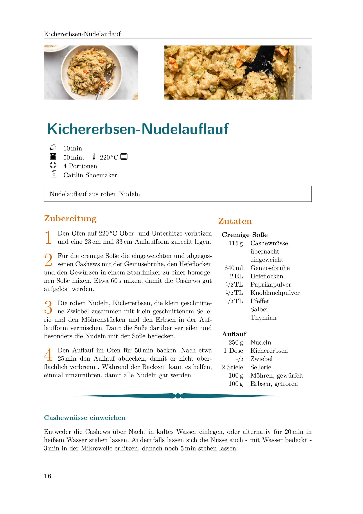

# Bronte-Project
[DE] Rezeptesammlung - vegane Ideen in LaTeX gegossen

Mit Hilfe des -Pakets [`xcookybooky`](https://www.ctan.org/pkg/xcookybooky).

## Inhalte dieser `README.md`
* [Beispiele: Auszüge der Rezepte](#Auszüge)
* [Beitrag leisten](#Beitragleisten)
  * [Synopse: `xcookybooky`-Paket](#Synopse)
  * [Rezept einpflegen](#einpflegen)
    * [Ordnerstruktur im Repository](#Ordnerstruktur)
    * [`recipe`-Umgebungen](#recipe-Umgebungen)
    * [`siunitx`-Paket](#siunitx)
    * [Abbildungen](#Abbildungen)
    * [Stichwortverzeichnis](#Stichwortverzeichnis)
    * [Rezept einbinden](#einbinden)
    * [Code-Beispiel](#Code-Beispiel)

---
---
<a name="Auszüge"></a>
# Beispiele: Auszüge der Rezepte


---

---


---
---
<a name="Beitragleisten"></a>
# Beitrag leisten
Für jeden, der sich am Kochbuch beteiligen will - vor allem aber für mich selbst - ist die Zusammenfassung von allen wichtigen Befehlen und Funktionsweisen der LaTeX-Inhalte. Das `xcookybooky`-Paket liefert das Framework und ist selbst in weiten Teilen sehr modular nutzbar. Ich habe aber eine (übersichtliche?) Ordnerstruktur entworfen und eigene `recipe`-Umgebungen definiert, die die eigentliche `xcookybooky`-Umgebung erweitern. Abbildungen und Einträge im Stichwortverzeichnis lassen sich für jedes Rezept hinzufügen.

<a name="Synopse"></a>
## Synopse: [`xcookybooky`](https://www.ctan.org/pkg/xcookybooky)-Paket
1. **`recipe`-Umgebung**: Wird verwendet, um Rezepte einzufügen. Jedes Rezept wird in einer eigenen Umbegung eingebunden. Notwendig ist die Angabe des Namens des Rezeptes, optional lassen sich dazu noch die Vorbereitungszeit `preparationtime`, die Backzeit `bakingtime`, die Backtemperatur `bakingtemperature`, die Portionen `portion`, den Brennwert der Mahlzeit `calory`und die Quelle `source` angeben. **Achtung**: die originale `recipe`-Umgebung wird ersetzt duch selbstdefinierte Umgebungen mit den gleichen Optionen, nur anderen Namen (siehe [`recipe`-Umgebungen](#recipe-Umgebungen)). Dies ist zum einen notwendig, um die Plazierung der Bilder zu verbessern und gleichzeitig, um mit einem Zähler alle Rezepte zu indizieren.
2. **`\graph`**: Ermöglicht das Einbinden von bis zu zwei Abbildungen in einem Rezept: ein kleines (wird der Option `small` zugeordnet) und ein großes (wird der Option `big` zugeordnet). Damit der gesamte Platz ausgenutzt wird, die Bildseitenverhältnisse aus Abschnitt [Abbildungen](#Abbildungen) beachten.
3. **`\ingredients`**: Schafft die tabellarische Formatierung der benötigten Zutaten; dazu das LaTeX-typische `&`-Trennzeichen und den Zeilenumbruch `\\` verwenden. Zudem empfiehlt sich das [`siunitx`-Paket](#siunitx).
4. **`\preparation`**: Erzeugt den Textkörper der Durchführungsschritte mit Nummerierung in Form von Initialen.
5. **`\introduction`**: Ermöglicht das Hinzufügen eines Einführungstextes vor dem eigentlichen Rezept, aber nach den Kurzinformationen unter den Bildern.
6. **`\suggestion`**: 
7. **`\portion`**:
8. **`\bakingtemperature`**:

<a name="einpflegen"></a>
## Rezept einpflegen

<a name="Ordnerstruktur"></a>
### Ordnerstruktur im Repository
Die Sortierung der Rezepte erfolgt auf erster Ebene in den Teilen (`\part{}`) I. bis VI., die eine grobe Sortierung vornehmen. Diese bilden auch die oberste Ordnerstruktur im Repository. Feiner wird dann in Unterkategorien (`\section{}`) sortiert. Diese wiederum werden durch Unterordner an den richtigen Stellen repräsentiert. In den Unterordnern wird dann für jedes Rezept ein Ordner angelegt, in dem die zugehörige `.tex`-Datei (siehe [Code-Beispiel](#Code-Beispiel)) sowie Bilddateien oder andere Rohdateien ihren Platz finden.

```
│
├── Frühstück
│   └── Zerealien
├── Gebaeck
│   ├── Brote
│   ├── Kekse
│   └── Kuchen
├── Getraenke
│   ├── alkoholische_Getraenke
│   └── nichtalkoholische_Getraenke
├── Hauptgerichte
│   ├── Auflaeufe
│   ├── Fingerfood
│   ├── Nudelgerichte
│   ├── Pfannengerichte
│   └── Suppen_und_Eintoepfe
├── Nachspeisen_und_Snacks
│   ├── Nachspeisen
│   └── Snacks
└── Vorspeisen_und_Beilagen
    ├── Aufstriche_und_Dips
    └── Salate
```

<a name="recipe-Umgebungen"></a>
### `recipe`-Umgebungen

<a name="siunitx"></a>
### [`siunitx`](https://ctan.org/pkg/siunitx)-Paket

<a name="Abbildungen"></a>
### Abbildungen

<a name="Stichwortverzeichnis"></a>
### Stichwortverzeichnis

<a name="einbinden"></a>
### Rezept einbinden

<a name="Code-Beispiel"></a>
### Code-Beispiel

```latex
\begin{RECIPE-UMGEBUNG}
    [
        preparationtime = {\SI{ZEIT}{\minute}},
        bakingtime = {\SI{ZEIT}{\minute} bis \SI{ZEIT}{\minute}},
        bakingtemperature = {\protect\bakingtemperature{fanoven=\SI{TEMPERATUR}{\celsius}}},
        portion = {PORTIONEN/MENGE},
        source = {QUELLE/HERAUSGEBER}
    ]
    {REZEPTNAME}

    \graph
        {
            big=TEIL/KAPITEL/REZEPT/big.jpg,
            small=TEIL/KAPITEL/REZEPT/small.jpg
        }

    \introduction{
        EINLEITUNG
    }

    \ingredients{
        \SI{1}{\ml} & ZUTAT 1 \\
        \SI{2}{\g} & ZUTAT 2 \\
        \\
        \multicolumn{2}{l}{\textbf{ABSCHNITTÜBERSCHRIFT}} \\
        \SI{3}{\EL} & ZUTAT 3 \\
        4 PRISEN & ZUTAT 4
    }

    \preparation{
        \step ANTLEITUNG IN MEHREREN SCHRITTEN
        \step NÄCHSTER SCHRITT...
    }

    \suggestion[TITEL EINES VORSCHLAGS]{
		VORSCHLAG (DURCH HORIZONTALE LINIE VOM REZEPT GETRENNT)
    }

    \hint{
        HINWEIS (IN EINEM KASTEN UNTEN AUF DER SEITE)
    }

\end{RECIPE-UMGEBUNG}
```
